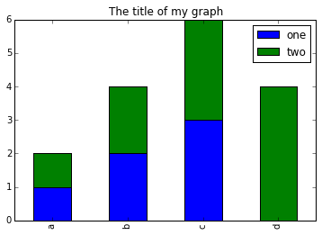
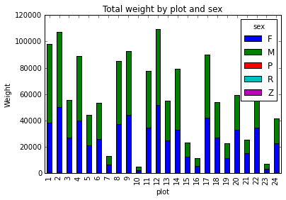

## Presentation of the survey data

For this lesson, we will be using some odd housing data. Imagine we get a dataset in every month that summarizes some basic facts of new households that moved to the region. We get basic information like the date they moved here, their district ID, city code, whether or not they rent/own (tenure), and household income. We have to continusouly analyze this data every month and create reports, so we want to script some of the analyses we use and streamline it. 

The mian dataset is stored as a `csv` file - surveys.csv: each row holds information for a
single household, and the columns represent:

| Column           		| 		Description                        |
|------------------		|------------------------------------|
| record_id             | Unique record id        |
| month      		| survey month               |
| day       	    | survey day      |
| year   	 	| survey year              |
| district         	  	| district location of household            |
| city    	    	| code for city location of household          |
| tenure         	  | indication of whether household is owner or renter of property     
| income  	  | household income, in hundreds of dollars |


### Download lesson data

Data is stored in the [course GitHub repository](https://github.com/psrc/python-ecology-lesson/tree/gh-pages/data)

---

### Learning Objectives
* Explain what a library is, and what libraries are used for.
* Load a Python/Pandas library.
* Read tabular data from a file into Python using Pandas using `read_csv`.
* Learn about the Pandas DataFrame object.
* Perform mathematical operations on numeric data.
* Create simple plots of data.


## About Libraries
A library in Python contains a set of tools (called functions) that perform
tasks on our data. Once a library is set up, it can be used or called to perform many tasks.

Imagine a library as a kitchen appliance. If you were making a loaf of bread, you could 
go to the agricultural co-op and buy some wheat germ, use a rock to crush the grains, 
culture your own yeast, mill your own sugar, or you just could just buy some pre-packaged
ingredients from the store and toss it into a bread-maker. It's time saving and it's build to serve a purpose.
I need bread, so I bring out the bread maker to the counter. 

For our purposes, we need to analyze data so we bring a statistical library onto our notebook counter. 
We'll be using pandas exclusively in this course. 

## Pandas in Python
One of the best options for working with tabular data in Python is to use the
[Python Data Analysis Library](http://pandas.pydata.org/) (a.k.a. Pandas). The
Pandas library provides data structures, produces high quality plots with
[matplotlib](http://matplotlib.org/) and integrates nicely with other libraries
that use [NumPy](http://www.numpy.org/) (which is another Python library) arrays.

### Importing Pandas

Python doesn't load all of the libraries available to it by default. We have to
add an `import` statement to our code in order to use library functions. To import
a library, we use the syntax `import libraryName`. If we want to give the
library a nickname to shorten the command, we can add `as nickNameHere`.  An
example of importing the pandas library using the common nickname `pd` is below.


```python
import pandas as pd
```

Each time we call a function that's in a library, we use the syntax
`LibraryName.FunctionName`. Adding the library name with a `.` before the
function name tells Python where to find the function. In the example above, we
have imported Pandas as `pd`. This means we don't have to type out `pandas` each
time we call a Pandas function.


## Lesson Overview

Let's pretend we are studying the income and tenure of new households to the region. The data sets are stored in .csv (comma separated values) format. Within
the `.csv` files, each row holds information for a single household, and the
columns represent: record_id, month, day, year, district, city, tenure, income.


### We want to:

1. Load that data into memory in Python.
2. Calculate the average income of all households sampled, by district.
3. Plot the average income by district and perhaps by city too.

We can automate the process above using Python. It's efficient to spend time
building the code to perform these tasks because once it's built, we can use it
over and over on diffent datasets that use a similar format. This makes our
methods easily reproducible. We can also easily share our code with colleagues
and they can replicate the same analysis.


# Reading CSV Data Using Pandas

We will begin by locating and reading our survey data which are in CSV format.
We can use Pandas' `read_csv` function to pull the file directly into a
[DataFrame](http://pandas.pydata.org/pandas-docs/stable/dsintro.html#dataframe).

## So What's a DataFrame?

A DataFrame is a 2-dimensional data structure that can store data of diffetenure
types (including characters, integers, floating point values, factors and more)
in columns. It is similar to a spreadsheet or an SQL table or the `data.frame` in
R.

First, let's make sure the Python Pandas library is loaded. We will import
Pandas using the nickname `pd`.

```python
import pandas as pd
```

Let's also import the [OS Library](https://docs.python.org/2/library/os.html).
This library allows us to make sure we are in the correct working directory. If
you are working in IPython Notebook, be sure to start the notebook in the
workshop repository.  If you didn't do that you can always set the working
directory using the code below.

```python
import os
os.getcwd()
# if this directory isn't right, use the command below to set the working directory
os.chdir("YOURPathHere")
```

```python
# note that pd.read_csv is used because we imported pandas as pd
pd.read_csv("surveys.csv")
```

The above command yields the **output** below:

```
record_id  month  day  year  district city tenure  hindfoot_length  income
0          1      7   16  1977        2         NL   M               32   NaN
1          2      7   16  1977        3         NL   M               33   NaN
2          3      7   16  1977        2         DM   F               37   NaN
3          4      7   16  1977        7         DM   M               36   NaN
4          5      7   16  1977        3         DM   M               35   NaN
...
35544      35545     12   31  2002       15     AH  NaN              NaN  NaN
35545      35546     12   31  2002       15     AH  NaN              NaN  NaN
35546      35547     12   31  2002       10     RM    F               15   14
35547      35548     12   31  2002        7     DO    M               36   51
35548      35549     12   31  2002        5     NaN  NaN             NaN  NaN

[35549 rows x 9 columns]
```

We can see that there were 33,549 rows parsed. Each row has 9
columns. It looks like  the `read_csv` function in Pandas read our file
properly. However, we haven't saved any data to memory so we can work with it.
We need to assign the DataFrame to a variable. Remember that a variable is a
name for a value, such as `x`, or  `data`. We can create a new object with a
variable name by assigning a value to it using `=`.

Let's call the imported survey data `surveys_df`:

```python
surveys_df = pd.read_csv("surveys.csv")
```

Notice when you assign the imported DataFrame to a variable, Python does not
produce any output on the screen. We can print the value of the `surveys_df`
object by typing its name into the Python command prompt.

```python
surveys_df
```

which prints contents like above

## Manipulating Our Survey Data

Now we can start manipulating our data. First, let's check the data type of the
data stored in `surveys_df` using the `type` method. The `type` method and
`__class__` attribute tell us that `surveys_df` is `<class 'pandas.core.frame.DataFrame'>`.

```python
type(surveys_df)
# this does the same thing as the above!
surveys_df.__class__
```
We can also enter `surveys_df.dtypes` at our prompt to view the data type for each
column in our DataFrame. `int64` represents numeric integer values - `int64` cells
can not store decimals. `object` represents strings (letters and numbers). `float64`
represents numbers with decimals.

	surveys_df.dtypes

which returns:

```
record_id            int64
month                int64
day                  int64
year                 int64
district              int64
city          object
tenure                 object
hindfoot_length    float64
income             float64
dtype: object
```

We'll talk a bit more about what the diffetenure formats mean in a diffetenure lesson.

### Useful Ways to View DataFrame objects in Python

There are multiple methods that can be used to summarize and access the data
stored in DataFrames. Let's try out a few. Note that we call the method by using
the object name `surveys_df.method`. So `surveys_df.columns` provides an index
of all of the column names in our DataFrame.

## Challenges

Try out the methods below to see what they return.

1. `surveys_df.columns`.
2. `surveys_df.head()`. Also, what does `surveys_df.head(15)` do?
3. `surveys_df.tail()`.
4. `surveys_df.shape`. Take note of the output of the shape method. What format does it return the shape of the DataFrame in?

HINT: [More on tuples, here](https://docs.python.org/2/tutorial/datastructures.html#tuples-and-sequences).


## Calculating Statistics From Data In A Pandas DataFrame

We've read our data into Python. Next, let's perform some quick summary
statistics to learn more about the data that we're working with. We might want
to know how many animals were collected in each plot, or how many of each
cities were caught. We can perform summary stats quickly using groups. But
first we need to figure out what we want to group by.

Let's begin by exploring our data:

```python
# Look at the column names
surveys_df.columns.values
```

which **returns**:

```
array(['record_id', 'month', 'day', 'year', 'type', 'district', 'tenure',
       'income'], dtype=object)
```

Let's get a list of all the cities. The `pd.unique` function tells us all of
the unique values in the `city` column.

```python
pd.unique(surveys_df.city)
```

which **returns**:

```python
array(['NL', 'DM', 'PF', 'PE', 'DS', 'PP', 'SH', 'OT', 'DO', 'OX', 'SS',
       'OL', 'RM', nan, 'SA', 'PM', 'AH', 'DX', 'AB', 'CB', 'CM', 'CQ',
       'RF', 'PC', 'PG', 'PH', 'PU', 'CV', 'UR', 'UP', 'ZL', 'UL', 'CS',
       'SC', 'BA', 'SF', 'RO', 'AS', 'SO', 'PI', 'ST', 'CU', 'SU', 'RX',
       'PB', 'PL', 'PX', 'CT', 'US'], dtype=object)
```

## Challenges

1. Create a list of unique district ID's found in the surveys data. Call it
   `districtNames`. How many unique districts are there in the data? How many unique
   cities are in the data?

# Groups in Pandas

We often want to calculate summary statistics grouped by subsets or attributes
within fields of our data. For example, we might want to calculate the average
income of all individuals per plot.

We can calculate basic statistics for all records in a single column using the
syntax below:

```python
surveys_df['income'].describe()
```
gives **output**

```python
count    32283.000000
mean        42.672428
std         36.631259
min          4.000000
25%         20.000000
50%         37.000000
75%         48.000000
max        280.000000
Name: income, dtype: float64
```

We can also extract one specific metric if we wish:

```python
surveys_df['income'].min()
surveys_df['income'].max()
surveys_df['income'].mean()
surveys_df['income'].std()
surveys_df['income'].count()
```

But if we want to summarize by one or more variables, for example tenure, we can
use Pandas' `.groupby` method. Once we've created a groupby DataFrame, we
can quickly calculate summary statistics by a group of our choice.

```python
# Group data by tenure
sorted = surveys_df.groupby('tenure')
```

The Pandas function `describe` will return descriptive stats including: mean,
median, max, min, std and count for a particular column in the data. Pandas'
`describe` function will only return summary values for columns containing
numeric data.

```python
# summary statistics for all numeric columns by tenure
sorted.describe()
# provide the mean for each numeric column by tenure
sorted.mean()
```

`sorted.mean()` **OUTPUT:**

```python
        record_id     month        day         year    district  \
tenure                                                              
F    18036.412046  6.583047  16.007138  1990.644997  11.440854   
M    17754.835601  6.392668  16.184286  1990.480401  11.098282   

     hindfoot_length     income  
tenure                              
F          28.836780  42.170555  
M          29.709578  42.995379  

```

The `groupby` command is powerful in that it allows us to quickly generate
summary stats.

# Challenge

1. How many recorded households are renters `R` and how many owners `O`
2. What happens when you group by two columns using the following syntax and
    then grab mean values:
	- `sorted2 = surveys_df.groupby(['district','tenure'])`
	- `sorted2.mean()`
3. Summarize income values for each plot in your data. HINT: you can use the
   following syntax to only create summary statistics for one column in your data
   `byPlot['income'].describe()`


Did you get #3 right? **A Snippet of the Output from challenge 3 looks like:**

```
	plot
	1     count    1903.000000
	      mean       51.822911
	      std        38.176670
	      min         4.000000
	      25%        30.000000
	      50%        44.000000
	      75%        53.000000
	      max       231.000000
          ...
```

## Quickly Creating Summary Counts in Pandas

Let's next create a list of unique cities in our data. We can do this in a few
ways, but we'll use `groupby` combined with a `count()` method.


```python
# count the number of samples by cities
cities_counts = surveys_df.groupby('city')['record_id'].count()
```

Or, we can also count just the rows that have the cities "DO":

```python
surveys_df.groupby('city')['record_id'].count()['DO']
```

## Basic Math Functions

If we wanted to, we could perform math on an entire column of our data. For
example let's multiply all income values by 100 to convert into standard dollars. 

	# multiply all income values by 100
	surveys_df['income']*100


## Another Challenge

1. What's another way to create a list of cities and associated `count` of the
   records in the data? Hint: you can perform `count`, `min`, etc functions on
   groupby DataFrames in the same way you can perform them on regular
   DataFrames.


# Quick & Easy Plotting Data Using Pandas

We can plot our summary stats using Pandas, too.

	# make sure figures appear inline in Ipython Notebook
	%matplotlib inline
	# create a quick bar chart
	cities_counts.plot(kind='bar');


income by city plot

We can also look at how many animals were captured in each plot:

```python
total_count=surveys_df.record_id.groupby(surveys_df['district']).nunique()
# let's plot that too
total_count.plot(kind='bar');
```

# Challenge Activities

1. Create a plot of average income across all cities per plot.
2. Create a plot of total owners versus total feowners for the entire dataset.


# Summary Plotting Challenge

Create a stacked bar plot, with income on the Y axis, and the stacked variable
being tenure. The plot should show total income by tenure for each plot. Some
tips are below to help you solve this challenge:

* [For more on Pandas plots, visit this link.](http://pandas.pydata.org/pandas-docs/dev/generated/pandas.core.groupby.DataFrameGroupBy.plot.html)
* You can use the code that follows to create a stacked bar plot but the data to stack
  need to be in individual columns.  Here's a simple example with some data where
  'a', 'b', and 'c' are the groups, and 'one' and 'two' are the subgroups.

```
d = {'one' : pd.Series([1., 2., 3.], index=['a', 'b', 'c']),'two' : pd.Series([1., 2., 3., 4.], index=['a', 'b', 'c', 'd'])}
pd.DataFrame(d)
```

shows the following data

```
       one  two
   a    1    1
   b    2    2
   c    3    3
   d  NaN    4
```

We can plot the above with

```
# plot stacked data so columns 'one' and 'two' are stacked
my_df = pd.DataFrame(d)
my_df.plot(kind='bar',stacked=True,title="The title of my graph")
```



* You can use the `.unstack()` method to transform grouped data into columns
for each plotting.  Try running `.unstack()` on some DataFrames above and see
what it yields.

Start by transforming the grouped data (by plot and tenure) into an unstacked layout, then create
a stacked plot.


## Solution to Summary Challenge

First we group data by plot and by tenure, and then calculate a total for each plot.

```python
by_plot_tenure = surveys_df.groupby(['district','tenure'])
plot_tenure_count = by_plot_tenure['income'].sum()
```

This calculates the sums of incomes for each tenure within each plot as a table

```
plot  tenure
district  tenure
1        R      38253
         O      59979
2        R      50144
         O      57250
3        R      27251
         O      28253
4        R      39796
         O      49377
<other plots removed for brevity>
```

Below we'll use `.unstack()` on our grouped data to figure out the total income that each tenure contributed to each plot.

```python
by_plot_tenure = surveys_df.groupby(['district','tenure'])
plot_tenure_count = by_plot_tenure['income'].sum()
plot_tenure_count.unstack()
```

The `unstack` function above will display the following output:

```
tenure          F      M
district              
1        38253  59979
2        50144  57250
3        27251  28253
4        39796  49377
<other plots removed for brevity>
```

Now, create a stacked bar plot with that data where the incomes for each tenure are stacked by plot.

Rather than display it as a table, we can plot the above data by stacking the values of each tenure as follows:

```python
by_plot_tenure = surveys_df.groupby(['district','tenure'])
plot_tenure_count = by_plot_tenure['income'].sum()
spc = plot_tenure_count.unstack()
s_plot = spc.plot(kind='bar',stacked=True,title="Total income by plot and tenure")
s_plot.set_ylabel("income")
s_plot.set_xlabel("Plot")
```


